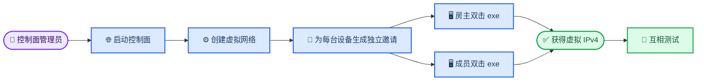

# IPv6Mesh

IPv6-first P2P Mesh VPN with a virtual IPv4 overlay.

The first release targets node-to-node connectivity on Windows. The design and discussion record are maintained in the [Memory repository](https://github.com/Eser-Tired/Memory).

## 📚 Current documentation

- [Architecture design](docs/architecture/2026-08-11-ipv6-first-mesh-vpn-design.md)
- [Implementation plan](docs/superpowers/plans/2026-08-11-ipv6-first-mesh-vpn-implementation.md)
- [Operator notes](docs/operator.md)

The v0.1 scope is virtual IPv4 node-to-node access, IPv6 Direct connectivity, and trusted Relay fallback. Subnet routing, LAN broadcast replication, exit nodes, mobile clients, and opaque Relay encryption are outside v0.1.

## 🏠 Windows 用户使用说明：房主与成员双击 `.exe` 入网

本节给出一个完整的“两台 Windows 11 玩 Steam 游戏”的案例。这里有两个可能由同一个人承担、但职责不同的角色：

- **控制面管理员**：启动 `control-server.exe`、创建网络、生成一次性邀请令牌
- **游戏房主**：启动游戏并作为第一台 VPN 节点加入网络
- **成员**：使用自己的邀请令牌加入同一个 VPN 网络

最简单的情况是：第一台电脑同时担任控制面管理员和游戏房主；第二台电脑是成员。新版 `v0.1.0-debug.12` 将三种角色统一放在一个中文可视化界面中，普通成员只需要双击 `.exe`，不需要打开 PowerShell，也不需要使用 `vpnctl`。

> ⚠️ 控制面必须先运行，节点安装器不会自动创建控制面。控制面可以运行在房主电脑、另一台服务器或具有全球 IPv6 的 VPS 上。

> 📌 一次性邀请令牌相当于一次性密码。每台设备必须使用不同令牌；不要把管理员令牌、邀请令牌写进公开聊天或截图。

### 角色分工

| 角色 | 主要工作 | 需要拿到的凭据 |
| --- | --- | --- |
| 控制面管理员 | 启动控制面、创建网络、生成邀请 | 管理员令牌 |
| 游戏房主 | 双击安装器、输入房主邀请、启动游戏 | 房主专属邀请令牌 |
| 游戏成员 | 双击安装器、输入成员邀请、连接房主 | 成员专属邀请令牌 |

### 联机流程

下面的流程图展示管理员如何创建网络和邀请，以及房主和成员如何使用各自令牌加入同一个虚拟 IPv4 网络。



### 1. 首选：使用统一中文 UI

下载 [v0.1.0-debug.12 Windows UI 安装器](https://github.com/Eser-s-Organization/ipv6mesh/releases/download/v0.1.0-debug.12/ipv6mesh-installer-0.1.0-debug.12.exe)。双击后在 UAC 对话框中点击“是”。程序会打开“IPv6Mesh 远程组网”窗口，顶部可以切换三种角色。SHA-256 以发布页中的 `.sha256` 文件为准。

如果旧版 `.5`、`.6`、`.7`、`.8`、`.9`、`.10` 或 `.11` 弹出 `run Chinese IPv6Mesh UI: exit status 1`，请改用 `.12`；`.12` 还会在控制面尚未启动或刚启动时给出明确提示，明确区分“随机生成 Network ID”和“创建网络”，并提供 Network ID、管理员令牌和邀请令牌的随机生成/一键复制按钮。`.12` 启动控制面和 `vpnctl` 时优先使用本次安装器携带的当前载荷，避免旧安装文件覆盖新版本；管理员令牌错误时会明确提示“健康检查只验证连接，不验证管理员身份”。

| UI 角色 | 主要按钮和操作 |
| --- | --- |
| 控制面管理员 | 随机生成管理员令牌和 Network ID、启动控制面、检查健康、创建网络、随机生成房主/成员邀请、一键复制 ID/令牌 |
| 游戏房主 | 输入房主邀请，点击“安装并加入 VPN”，刷新状态、连接、断开或离开网络 |
| 游戏成员 | 输入成员邀请，点击“安装并加入 VPN”，刷新状态、连接、断开或离开网络 |

#### 管理员在 UI 中创建网络

第一台具有可访问全球 IPv6 的电脑可以同时作为控制面管理员和游戏房主：

1. 选择角色“控制面管理员”。
2. UI 会自动检测本机可用的全局 IPv6，并填入“本机 IPv6”；输入控制面端口（默认 `8080`），程序会自动生成类似 `http://[2408:8256:1980:119b:f2c8:40bb:1e01:4182]:8080` 的 URL，同时把监听地址设置为 `[::]:8080`。如果检测结果不正确，可手动修改 IPv6 或点击“自动检测”。
3. 在“管理员令牌”右侧点击“随机生成”，再点击“复制管理员令牌”保存或转交给受信任的管理员；也可以粘贴一个由密码管理器生成的长随机令牌。令牌只保存在本次 UI 会话中，不写入日志。
4. 点击“启动控制面”，UI 会启动 `control-server.exe`，尝试自动放行所填端口的 TCP 防火墙规则，并把控制面输出写入日志。程序会自动等待 `/healthz` 就绪。
5. 确认状态变为“控制面可访问”；如果尚未启动控制面就点击“检查健康”，UI 会提示先启动控制面，而不会把连接拒绝误报成程序崩溃。
6. 填写网络名称 `friends-steam`、IPv4 地址池 `10.42.0.0/24`。点击 Network ID 右侧“随机生成”，再点击“复制 Network ID”保存；也可以手工填写一个只含字母、数字、`-`、`_`、`.`、`:` 的 ID。**随机生成只是在输入框准备 ID，不会创建网络。必须先点击“创建网络”，看到日志提示“网络已创建”后，再生成邀请。**如果留空，UI 会在创建前自动生成一个密码学随机 ID。每台设备加入时，控制面会从地址池随机选择一个可用虚拟 IPv4；分配结果会写入控制面数据，之后保持不变。
7. 点击“随机生成房主邀请”和“随机生成成员邀请”，分别使用“复制房主令牌”和“复制成员令牌”发送给对应设备。令牌由控制面使用密码学安全随机数生成，并同时保存令牌哈希；UI 只在专用框中显示一次性令牌，不写入日志。

UI 默认使用内存仓库；关闭 UI 会停止本窗口启动的控制面、停止本机 IPv6Mesh 服务，并由服务清理 WireGuard 适配器、虚拟 IPv4 地址和路由。安装文件和节点身份不会被删除，但内存控制面重启后网络和邀请会丢失。长期使用请改用 PostgreSQL 配置，并让控制面进程保持运行。

#### 手动退出和资源清理

点击窗口右上角关闭按钮或正常退出 UI 时，会执行一次清理：停止本机节点服务、清理虚拟网卡/地址/路由、关闭本窗口启动的控制面和事件订阅。若正在调试双机互访，关闭任一台的 UI 会使该台 VPN 断开；重新使用时需要重新启动 UI 和节点服务。

#### 房主和成员在 UI 中加入网络

1. 房主选择“游戏房主”，成员选择“游戏成员”。
2. 两台电脑填写相同的“控制面 URL”。
3. 房主填写房主专属邀请，成员填写成员专属邀请；不要交叉使用，也不要填写管理员令牌。
4. 填写设备名，例如 `win11-host` 和 `win11-member`。
5. 点击“安装并加入 VPN”。程序会停止旧服务、安装/更新节点服务、加入网络、连接虚拟适配器，并在状态和日志中显示 Network ID、随机分配的虚拟 IPv4、Path。
6. 出现错误时，点击“复制日志”或“导出日志”保存 debug 信息；分享前检查日志中没有不应公开的主机信息。

管理员创建网络后，普通房主/成员只需要以上步骤，不需要运行后面的 PowerShell 或 `vpnctl` 命令。

### 2. 开发者备用：手动准备控制面

如果控制面已经在运行，例如当前测试地址：

```text
http://[2408:8256:1980:119b:f2c8:40bb:1e01:4182]:8080
```

可以直接跳到“创建网络和邀请”。如果还没有启动控制面，在控制面主机的**管理员 PowerShell**中执行下面的临时测试配置：

```powershell
# 仅在控制面主机执行；控制面终端需要保持运行
$controlUrl = 'http://[2408:8256:1980:119b:f2c8:40bb:1e01:4182]:8080'
$adminToken = '<只保存在管理员电脑上的长随机令牌>'

$env:CONTROL_LISTEN_ADDRESS = '[::]:8080'
$env:CONTROL_BOOTSTRAP_TOKEN = $adminToken
$env:CONTROL_SESSION_TTL = '24h'
$env:CONTROL_INVITE_TTL = '24h'
$env:CONTROL_REPOSITORY_MODE = 'memory'

$ruleName = 'IPv6Mesh Control Plane TCP 8080'
if (-not (Get-NetFirewallRule -DisplayName $ruleName -ErrorAction SilentlyContinue)) {
    New-NetFirewallRule `
        -DisplayName $ruleName `
        -Direction Inbound `
        -Protocol TCP `
        -LocalPort 8080 `
        -Action Allow `
        -Profile Any | Out-Null
}

& 'C:\Program Files\IPv6Mesh\control-server.exe'
```

如果 `control-server.exe` 不在 `C:\Program Files\IPv6Mesh`，把最后一行替换为实际路径。控制面主机必须满足：

- 具有可从成员电脑访问的全球 IPv6 地址
- 防火墙允许 TCP 8080
- 控制面进程持续运行
- 测试版使用内存仓库；控制面进程重启后，网络、邀请和会话会丢失

在另一台电脑上验证控制面：

```powershell
$controlUrl = 'http://[2408:8256:1980:119b:f2c8:40bb:1e01:4182]:8080'
Invoke-WebRequest -UseBasicParsing -Uri ($controlUrl + '/healthz')
```

看到 HTTP `200` 和 `ok` 后再创建网络。

### 3. 开发者备用：命令行创建网络和生成邀请

控制面管理员在已经安装 `vpnctl.exe` 的管理员 PowerShell 中执行。普通成员不执行这些命令。

```powershell
$controlUrl = 'http://[2408:8256:1980:119b:f2c8:40bb:1e01:4182]:8080'
$adminToken = '<与 CONTROL_BOOTSTRAP_TOKEN 相同的管理员令牌>'
$vpnctl = 'C:\Program Files\IPv6Mesh\vpnctl.exe'

$env:IPV6MESH_CONTROL_URL = $controlUrl
$env:IPV6MESH_ADMIN_TOKEN = $adminToken

$network = & $vpnctl network create `
    --name 'friends-steam' `
    --pool '10.42.0.0/24' | ConvertFrom-Json

$network | Format-List

$hostInvite = & $vpnctl invite create `
    --network $network.id `
    --expires '24h' | ConvertFrom-Json

$memberInvite = & $vpnctl invite create `
    --network $network.id `
    --expires '24h' | ConvertFrom-Json

Write-Host "Network ID: $($network.id)"
Write-Host "Host invite: $($hostInvite.token)"
Write-Host "Member invite: $($memberInvite.token)"
```

示例输出结构如下；实际 `id` 和 `token` 以本次输出为准：

```text
Network ID: NcsEPEnP_hupgeOEQG2LyQ
Host invite: <host-one-time-token>
Member invite: <member-one-time-token>
```

注意：

- `Network ID` 不是秘密，但管理员应保存它；UI 可以随机生成并一键复制，普通成员通常不需要输入它
- 房主和每个成员必须使用不同的邀请令牌
- 邀请令牌成功加入后即被消耗，不能重复使用
- 如果只增加新成员，只执行第二条 `invite create`，不要重复创建网络
- 管理员令牌不能粘贴到安装器的 `One-time invite token` 输入框

### 4. 房主电脑加入 VPN（命令行兼容流程）

以第一台 Windows 11 作为游戏房主为例：

1. 下载 [v0.1.0-debug.12 Windows UI 安装器](https://github.com/Eser-s-Organization/ipv6mesh/releases/download/v0.1.0-debug.12/ipv6mesh-installer-0.1.0-debug.12.exe)
2. 双击运行，Windows UAC 弹出后点击“是”，选择角色“游戏房主”
3. 在 UI 中输入：

| UI 字段 | 房主输入 |
| --- | --- |
| `控制面 URL` | `http://[2408:8256:1980:119b:f2c8:40bb:1e01:4182]:8080` |
| `当前角色邀请` | `<host-one-time-token>` |
| `设备名` | `win11-host` |

4. 点击“安装并加入 VPN”；程序会自动停止旧服务、安装文件、启动服务、加入网络并连接虚拟网卡
5. 看到状态和日志中显示类似信息后，记下本机实际随机分配的虚拟 IPv4：

```text
IPv6Mesh is connected.
Network: NcsEPEnP_hupgeOEQG2LyQ
Virtual IPv4: 10.42.0.2
Path: Direct
```

`10.42.0.2` 只是示例，实际地址可能是地址池中的任意可用主机地址，必须使用 UI 实际显示的地址。分配结果在控制面数据中保持不变；如果使用内存仓库并重启控制面，网络和分配记录会一起丢失。

### 5. 成员电脑加入 VPN（命令行兼容流程）

以第二台 Windows 11 作为成员为例：

1. 下载同一个 `.exe`
2. 双击运行并在 UAC 中点击“是”，选择角色“游戏成员”
3. 在 UI 中输入：

| UI 字段 | 成员输入 |
| --- | --- |
| `控制面 URL` | 与房主完全相同的控制面 URL |
| `当前角色邀请` | `<member-one-time-token>` |
| `设备名` | `win11-member` |

4. 点击“安装并加入 VPN”，等待状态显示节点已连接
5. 记下成员自己的虚拟 IPv4；它可能不是 `.3`，以 UI 实际显示值为准。

成员不需要输入房主的虚拟 IPv4、`Network ID`、管理员令牌或物理局域网 IPv4。成员只需要自己的邀请令牌。

### 6. 验证两台电脑互访

下面只是一个示例；随机分配后两台设备实际显示的地址可能不同：

| 设备 | 虚拟 IPv4 |
| --- | --- |
| 房主 `win11-host` | `10.42.0.2` |
| 成员 `win11-member` | `10.42.0.3` |

在成员电脑上测试房主：

```powershell
ping.exe -4 -n 4 10.42.0.2
```

在房主电脑上反向测试成员：

```powershell
ping.exe -4 -n 4 10.42.0.3
```

如果需要测试具体 TCP 端口：

```powershell
Test-NetConnection -ComputerName 10.42.0.2 -Port <游戏监听端口>
```

`ping` 被 Windows 防火墙阻止并不一定代表 WireGuard 失败；可以同时检查目标游戏端口的 TCP 测试结果。开发者还可以从源码或 Windows 验收包目录运行：

```powershell
.\acceptance.ps1 `
    -NetworkId 'NcsEPEnP_hupgeOEQG2LyQ' `
    -PeerVirtualIPv4 '10.42.0.2'
```

普通成员不需要运行验收脚本。

### 7. 使用 Steam 游戏

完成虚拟 IPv4 互访后：

1. 房主先启动游戏并创建房间或主机
2. 如果游戏支持直接 IP 加入，成员填写房主的虚拟 IPv4，例如 `10.42.0.2`
3. 如果游戏要求端口，填写 `10.42.0.2:<游戏端口>`
4. 如果游戏只依赖局域网广播发现，当前 v0.1 不保证自动显示房间；优先使用 Steam 邀请或游戏的直接 IP 加入功能
5. Windows 防火墙可能还需要允许具体游戏的监听端口；安装器只负责 IPv6Mesh/WireGuard 的基础规则

IPv6Mesh 提供的是节点之间的虚拟 IPv4 互访，不会替代 Steam 账号、游戏服务器或游戏自己的联机协议。

### UI 日志和常见问题

UI 日志会记录安装脚本、`control-server.exe`、`vpnctl`、健康检查和节点状态的时间戳结果，但会刻意跳过管理员令牌和一次性邀请令牌。日志窗口提供“复制日志”和“导出日志”；导出的日志适合提交 debug 问题，令牌仍需通过专用输入框单独传递。

- **控制面连接失败**：管理员应先点击“启动控制面”，等待 UI 提示健康检查通过；再确认控制面进程仍在运行、TCP 端口已放行、IPv6 地址可达，并且 URL 使用 `http://[IPv6]:8080` 格式。控制面刚启动时请等待几秒再检查。
- **`HTTP status 404 (not_found)` 或“Network ID 不存在”**：只点击“随机生成”不会创建网络。管理员必须先点击“创建网络”，确认日志出现“网络已创建”，再生成房主/成员邀请；如果使用已有网络，请确认 Network ID 和控制面 URL 属于同一个控制面。
- **`HTTP status 401 (unauthorized)` 或“管理员令牌无效或与控制面启动令牌不一致”**：`/healthz` 返回 200 只表示控制面端口可达，不表示管理员令牌正确。请使用启动该控制面时设置的同一个管理员令牌。如果控制面是本机上一次运行遗留的旧 `control-server.exe`，先停止旧进程，再在当前 UI 中使用当前令牌点击“启动控制面”；看到“控制面已就绪，健康检查通过”后再点击“创建网络”。不要仅点击“检查健康”后直接创建网络，也不要在控制面启动后重新生成令牌。
- **`invite already used`**：令牌已经被成功使用或已经过期，管理员需要为该设备生成新令牌
- **`open \\.\pipe\ipv6mesh`**：服务没有成功安装或没有运行，重新双击 `.12` 并确认 UAC 已授权；可在 UI 中点击“刷新状态”查看日志
- **旧版本提示文件正在使用**：使用 `.12`；安装脚本会先停止旧服务并等待文件解锁，UI 关闭时也会停止服务并清理虚拟网络资源
- **控制面重启后网络消失**：当前示例使用内存仓库，测试数据随控制面进程退出而丢失；需要长期使用时应部署 PostgreSQL
- **两台都显示已连接但游戏找不到房间**：先用虚拟 IPv4 和游戏端口测试，再检查游戏的 LAN 发现机制和 Windows 防火墙
- **虚拟 IPv4 与本地 IPv4 不同**：这是预期行为；游戏应在支持的情况下使用 `Virtual IPv4`，不要使用 `10.20.x.x` 等物理局域网地址

### 卸载节点

卸载会停止服务并删除已安装二进制；默认保留节点身份和 `C:\ProgramData\IPv6Mesh` 数据。管理员 PowerShell 执行：

```powershell
Stop-Service -Name 'IPv6Mesh' -Force -ErrorAction SilentlyContinue
sc.exe delete IPv6Mesh
Remove-NetFirewallRule -DisplayName 'IPv6Mesh WireGuard UDP 51820' -ErrorAction SilentlyContinue
Remove-Item -LiteralPath 'C:\Program Files\IPv6Mesh' -Recurse -Force
```

只有确认不再需要本机身份时，才删除 `C:\ProgramData\IPv6Mesh`；删除后再次加入需要新的邀请令牌。

## 📋 Implemented milestones

- Control-plane enrollment, random-then-stable virtual IPv4 allocation, scoped authorization, and versioned snapshots.
- Windows service boundary with protected identity storage and strict Named Pipe IPC.
- WireGuardNT ABI adapter and Windows IP Helper route reconciler with host-only overlay routes. The official `wireguard.dll` is intentionally not committed; see [runtime provenance](third_party/wireguardnt/README.md).
- Windows IPv6 candidate discovery, authenticated control-plane heartbeats, strict HTTPS/WebSocket client decoding with bounded reconnect, and generation-safe WireGuard/IPv4 snapshot reconciliation.
- Trusted Relay configuration validation, Linux `wg`/`ip` execution boundaries, owned overlay-route cleanup, and Direct/Relay path hysteresis.

Live Relay failover, Linux network-namespace validation, live two-node WireGuardNT validation, and administrator-level route/DLL acceptance tests still require the later implementation tasks and multi-node acceptance tests.
